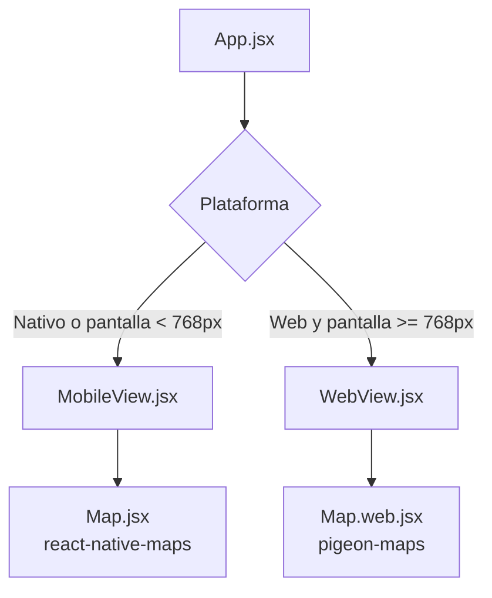

# 🗺️ Mapa USM

Aplicación interactiva desarrollada en **React Native / Expo** para explorar el campus de la Universidad Santa María (USM). Proporciona un mapa en **2D y 3D** que funciona de forma nativa en **Android, iOS** y en cualquier **navegador web**.

---

## ✨ Características Principales

- **Multiplataforma real:** Código único con experiencias optimizadas para móvil y escritorio.
- **Mapa 2D interactivo:** Navegación por puntos de interés (POI) con filtros por categorías.
- **Búsqueda inteligente:** Busca lugares por nombre, departamento o número de módulo.
- **Vista 3D:** Representación volumétrica de los edificios principales del campus.
- **Información detallada:** Direcciones paso a paso, departamentos y módulos disponibles al seleccionar un lugar.

---

## 🛠️ Stack Tecnológico

| Tecnología | Uso |
|------------|-----|
| [Expo](https://expo.dev) ~54.0.0 | Framework y toolchain |
| [React Native](https://reactnative.dev) 0.81.5 | Framework nativo |
| [React](https://react.dev) 19.1.0 | UI library |
| [react-native-maps](https://github.com/react-native-maps/react-native-maps) | Mapa en Android / iOS |
| [pigeon-maps](https://github.com/mariusandra/pigeon-maps) | Mapa en Web |
| [@react-three/fiber](https://github.com/pmndrs/react-three-fiber) + [Three.js](https://threejs.org) | Renderizado 3D |
| [@expo/vector-icons](https://github.com/expo/vector-icons) | Iconografía vectorial |
| [Sharp](https://sharp.pixelplumbing.com) (solo local) | Generación de assets PNG |

---

## 📁 Estructura de Carpetas

```
Mapa-USM/
├── assets/                  # Iconos de app, splash, favicon y mapa base
├── scripts/
│   └── generate_icons_v2.js # Generador de marcadores PNG para nativo
├── src/
│   ├── App.jsx              # Punto de entrada: decide MobileView vs WebView
│   ├── assets/
│   │   ├── logousm/         # Logo institucional
│   │   ├── marker.svg       # Plantilla base de marcador
│   │   └── markers/         # PNGs generados automáticamente (nativo)
│   ├── components/
│   │   ├── Map.jsx          # Mapa para nativo (react-native-maps)
│   │   ├── Map.web.jsx      # Mapa para web (pigeon-maps)
│   │   ├── Map3D.jsx        # Escena 3D con Three.js
│   │   ├── MobileView.jsx   # Layout y lógica para móvil
│   │   ├── WebView.jsx      # Layout y lógica para web
│   │   ├── mobile/
│   │   │   ├── MapLegend.jsx      # Panel inferior de detalles (rediseñado)
│   │   │   ├── SearchBar.jsx      # Barra de búsqueda
│   │   │   └── SidebarMenu.jsx    # Menú lateral compartido
│   │   └── ui/
│   │       ├── BottomControls.jsx # Controles 2D/3D y ajustes
│   │       └── MenuItem.jsx       # Ítem individual del menú
│   ├── data/
│   │   ├── buildings3DData.js # Polígonos de edificios para la vista 3D
│   │   ├── iconUtils.js       # Helper para renderizar iconos
│   │   ├── markersData.js     # Puntos de interés del mapa 2D (con direcciones)
│   │   └── menuData.js        # Categorías y submenús del sidebar
│   ├── styles/
│   │   ├── MobileViewStyles.js
│   │   └── WebViewStyles.js
│   └── utils/
│       └── mapCalculations.js # Utilidades geoespaciales
├── app.json                 # Configuración de Expo
├── index.js                 # Registro del componente raíz
├── package.json
└── vercel.json              # Configuración para despliegue en Vercel
```

---

## 🚀 Guía de Inicio Rápido

### 1. Prerrequisitos
- [Node.js](https://nodejs.org/) (versión LTS recomendada, >= 20).
- Para desarrollo nativo: Expo Go en tu dispositivo o un emulador configurado.

### 2. Instalación

```bash
npm install
```

### 3. Ejecutar el servidor de desarrollo

```bash
npx expo start
```

> **Consejo:** Una vez iniciado el servidor:
> - Presiona **`w`** para abrir la versión **Web** en tu navegador.
> - Presiona **`a`** para abrir la aplicación en tu emulador de **Android**.
> - Escanea el código QR con Expo Go para abrir en un dispositivo físico.
> - Si tienes problemas de red en WSL, usa: `npx expo start --tunnel`

---

## 🏛️ Arquitectura: Móvil vs Web

Este proyecto utiliza un patrón de **Divergencia de Componentes**: el bundler de Expo (Metro/Webpack) selecciona automáticamente el archivo correcto según la plataforma.



### ¿Por qué dos mapas?

- **Nativo (`Map.jsx`):** Usa `react-native-maps`. La nueva arquitectura de Android (**Fabric**) presenta un *bug de recorte* (clipping) cuando se usan vistas personalizadas como marcadores. Por eso, la versión móvil utiliza **imágenes PNG estáticas** pre-generadas, que funcionan con total fiabilidad y 60 fps.
- **Web (`Map.web.jsx`):** Usa `pigeon-maps`, diseñado específicamente para React DOM. Aquí **no sufre el bug de Fabric**, así que se aprovechan los **iconos vectoriales** de `@expo/vector-icons` en tiempo real, sin necesidad de archivos PNG.

Gracias a Metro, cuando compilas para web se ignora por completo `react-native-maps`, y viceversa, manteniendo el bundle ligero.

---

## 🗄️ Estructuras de Datos

La aplicación es impulsada por datos. La relación entre el menú lateral y los marcadores del mapa se establece a través de identificadores.

### `src/data/menuData.js`

Define las categorías y submenús visibles en el sidebar.

```javascript
// Ejemplo de ítem de menú
{
  id: 'f1',               // Identificador único
  title: 'Estudios Internacionales',
  iconFamily: 'FontAwesome5',
  iconName: 'globe-americas',
  size: 24
}
```

### `src/data/markersData.js`

Contiene todos los puntos de interés (POI) del mapa 2D. Ahora incluye **direcciones paso a paso reales** desde la parada de buses.

```javascript
// Ejemplo de marcador
{
  id: 'm1',
  subItemId: 'f1',        // Enlaza con el ícono específico del submenú
  categoryId: '1',        // Enlaza con la categoría principal
  title: 'Estudios Internacionales',
  color: 'blue',
  latitude: 10.4915,      // Nota: campos planos, no un objeto 'coordinate'
  longitude: -66.7818,
  address: 'Desde la parada de buses, suba las escaleras hasta llegar a plaza central...',
  departments: [],
  modules: []
}
```

> **Importante:** Los marcadores usan campos `latitude` y `longitude` directamente (no un objeto anidado `coordinate`). Esto garantiza compatibilidad con los cálculos de región y los componentes de mapa.

### `src/data/buildings3DData.js`

Almacena los edificios que se renderizan en la vista 3D. Son **completamente estáticos** y no se ven afectados por los filtros del sidebar.

```javascript
// Ejemplo de edificio 3D
{
  id: "Facultad de Ingeniería y Arquitectura",
  path: "M 408.23 277.18 ... Z", // Coordenadas SVG
  height: 0.7,
  color: "#9e9e9e",
  opacity: 1
}
```

---

## 🎨 Generación de Marcadores (Nativo)

Los marcadores de la app nativa deben ser imágenes `.png` para evitar el bug de renderizado de Android. El script `scripts/generate_icons_v2.js` automatiza este proceso:

1. Lee los mapeos de iconos definidos en el script.
2. Descarga los vectores desde la API de [Iconify](https://iconify.design/).
3. Compone cada marcador sobre una plantilla SVG (forma de púa + círculo blanco + icono).
4. Renderiza a PNG de 90x90 px usando **Sharp**.

### Uso

> ⚠️ **No agregues `sharp` a `package.json`** de la app, ya que es una librería nativa de servidor y romperá la compilación móvil.

```bash
# Instalar temporalmente
npm install sharp --no-save

# Generar imágenes
node scripts/generate_icons_v2.js

# Limpiar
npm uninstall sharp
```

Los archivos resultantes se guardan en `src/assets/markers/`.

---

## 🛠️ Cómo Contribuir

### Agregar una nueva locación al mapa

1. **Opcional — Vista 3D:** Si el edificio debe aparecer en el mapa 3D, añade su polígono en `src/data/buildings3DData.js` con su `path` SVG, `height` y `color`.
2. **Crear el filtro UI:** Registra el lugar en `src/data/menuData.js` (categoría o submenú correspondiente). Toma nota del `id` que asignes.
3. **Anclar el marcador geográfico:** Añade la entrada en `src/data/markersData.js`:
   - Coordenadas exactas (`latitude`, `longitude`).
   - `categoryId` y `subItemId` que enlacen con el paso anterior.
   - `address`, `departments` y `modules` según corresponda.
4. **Generar el ícono nativo:** Si la nueva locación usa un icono que no existe aún en `src/assets/markers/`, actualiza el diccionario `iconMappings` en `scripts/generate_icons_v2.js` y ejecuta el script.

### Reportar errores

Si encuentras un bug o tienes una sugerencia, por favor abre un *issue* describiendo:
- Pasos para reproducirlo.
- Comportamiento esperado vs. actual.
- Capturas de pantalla (si aplica).

---

## 📄 Licencia

Este proyecto está licenciado bajo la [Licencia MIT](LICENSE).

```
Copyright (c) 2025 Universidad Santa María (USM)

Permission is hereby granted, free of charge, to any person obtaining a copy
of this software and associated documentation files (the "Software"), to deal
in the Software without restriction, including without limitation the rights
to use, copy, modify, merge, publish, distribute, sublicense, and/or sell
copies of the Software, and to permit persons to whom the Software is
furnished to do so, subject to the following conditions:

The above copyright notice and this permission notice shall be included in all
copies or substantial portions of the Software.

THE SOFTWARE IS PROVIDED "AS IS", WITHOUT WARRANTY OF ANY KIND, EXPRESS OR
IMPLIED, INCLUDING BUT NOT LIMITED TO THE WARRANTIES OF MERCHANTABILITY,
FITNESS FOR A PARTICULAR PURPOSE AND NONINFRINGEMENT. IN NO EVENT SHALL THE
AUTHORS OR COPYRIGHT HOLDERS BE LIABLE FOR ANY CLAIM, DAMAGES OR OTHER
LIABILITY, WHETHER IN AN ACTION OF CONTRACT, TORT OR OTHERWISE, ARISING FROM,
OUT OF OR IN CONNECTION WITH THE SOFTWARE OR THE USE OR OTHER DEALINGS IN THE
SOFTWARE.
```

---

> Hecho con ❤️ para la comunidad usemista.
